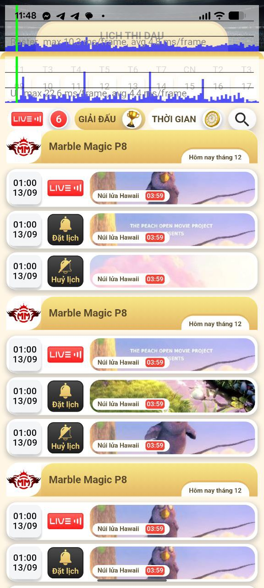

## Screenshot Output

### Main Screen


### Video Frame Thumbnail



## Prerequisites

- Flutter SDK installed.
- Dart SDK compatible with `^3.8.1` (from `pubspec.yaml`).
- Android Studio / Xcode / VS Code (any Flutter-supported IDE).
- At least one connected device or emulator.

## Run Locally

1. Clone this repository.
2. Get dependencies:

```bash
flutter pub get
```

3. Confirm available devices:

```bash
flutter devices
```

4. Run the app:

```bash
flutter run
```

Optional: run static analysis and tests

```bash
flutter analyze
flutter test
```
